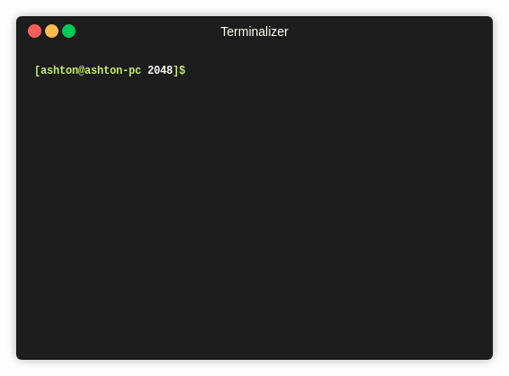

# quick2048

This is a project that I made in december of 2017 after taking a
number of higher level computer science classes. My intention was to
see how quickly I could do the introduction level computer science
final project using what I knew C++.

After working on the project for 1.5 hours I finished all the 
features required for the project as well as the extra credit
features - which just included a working board and a score. Then I
starting adding ridiculous features because I wanted to see how
far I could take the assignment. And then I took it too far.


## Controls

game mode: 
- '0'-'9' --- set the base system of the game
- 'w' --- move game pieces up
- 'a' --- move game pieces left
- 's' --- move game pieces down
- 'd' --- move game pieces right
- 'r' --- switch to resizing mode
- 'q' --- quit

resizing mode:
- 'w' --- increase height of the board
- 'a' --- decrease width of the board
- 's' --- decrease height of the board
- 'd' --- increase width of the board
- 'r' --- switch to game mode
- 'q' --- quit

# Features

## Normal Features

The game works like a normal 2048 game. You hit the 'w' 'a' 's'
'd' buttons to move the blocks around. Your score increases based
on the number that was made by merging two blocks. You can quit
the game by hitting the 'q' button.

## Whack Features

Since the game 2048 already exists in the universe in a fun and 
playable way, there really wasn't much need for me to create a version
of this game that was also fun and playable - so I added a two
completely game breaking features which made the game exponentially
more difficult to get working (pun intended). 

- Changing the base System
- Resizing the board mid game

## Changing Base 

In order to change the base system, you can hit any of the numbers
between 0-9 on the keyboard mid game. This will change the base of
of all numbers in the blocks, as well as recalculate the score as
if you had been playing in that base for the whole time.


One of the more difficult things to get right was having the board
resize itself based on the maximum string length of the integers in
the blocks. Note that for base 10 the number length increases and
forces the board to resize.

## Resizing

I added the resizing because - frankly - I got so caught up in whether
I *could* do it, that I disregarded whether I *should* do it. This 
feature completely breaks the game, and removes any amount of skill
required to get a high score.

In order to resize the board in the middle of the game, you need to 
hit the 'r' button and then use the 'w' 'a' 's' and 'd' buttons as 
you normally would in game to resize the board. Notice that the
background of the board changes color slightly to  Alet you know 
what mode you're in. 


One of the really nice looking features that turned out much better than
expected was the resizing of the score at the bottom of the board so that
it only shows you the part of the score you'd probably want to see if you
were playing. As well, if you're playing and choose to resize the board
such that there aren't any blocks on the board - the board will give you a new block so that your game isn't stuck.

## More Robust than Expected..?

It's been a little more than I year since I wrote this bad boy, 
so I decided to try breaking it with somewhat reasonable inputs.
How does this program handle negative numbers?

I made a minor change to main.cpp so that setting the base would
actually set the base to be the negative version of that base. The
change can be seen below:

```c++
        // lines 141 - 145 in main.cpp
        if (temp >= '0' && temp <= '9') {
            if (temp == '0') temp = '9'+1;
            // originally game.set_power(temp - '0');
            game.set_power(-(temp - '0')); 
            cout << game;
        }
```

To quickly explain the above code - the variable ingeniously named
'temp' holds the ascii encoding of the key pressed by the user in
the terminal. Here, we normally subtract the ascii encoding for 0
because the 0-9 are encoded as the ascii numbers 48 - 57 respectively
to get out the actual number 0-9 that the user intended. We're now
negating that number because we want to set the base to be the
negative version of the number the user intended. 



Apparently this works perfectly! Notice that the score will actually
go down when merging two numbers and producing a negative number. 